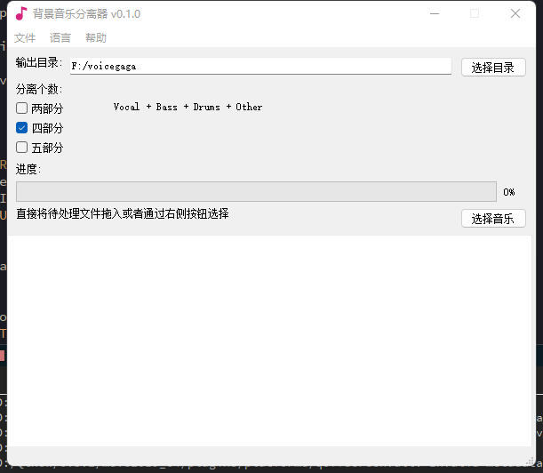

## SpeeterGUI
用Qt开发的Spleeter工具，只把界面弄好了，功能等以后用空了再弄吧

## References
* [SpleeterMsvcExe](https://github.com/wudicgi/SpleeterMsvcExe)
* [spleeter](https://github.com/deezer/spleeter)
* [SpleeterGui](https://github.com/boy1dr/SpleeterGui)
* [spleeterpp](https://github.com/gvne/spleeterpp)

## Screencast
